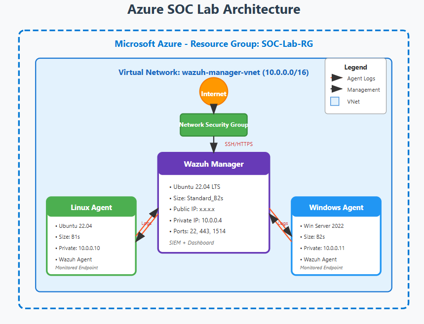
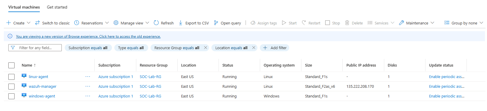
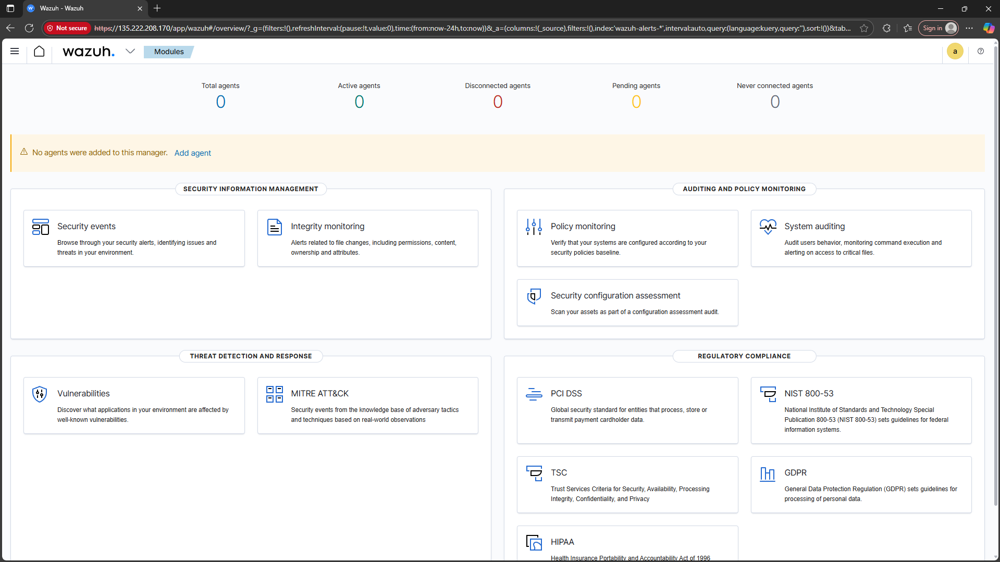
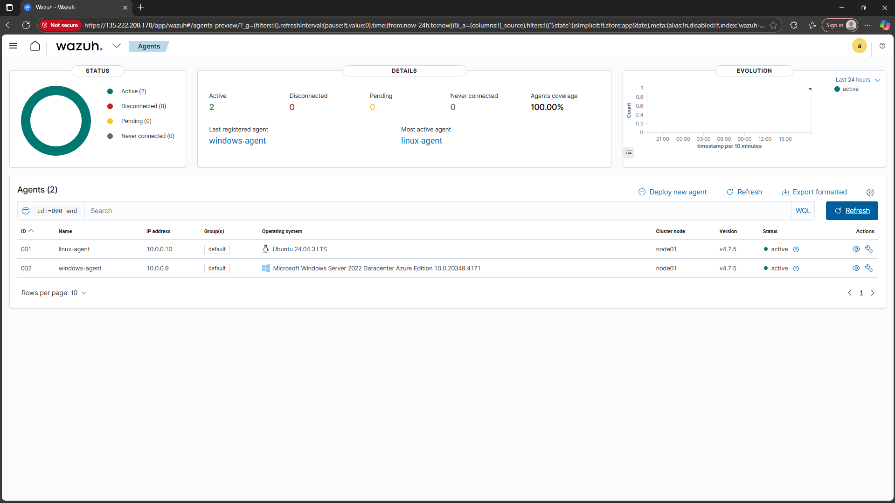
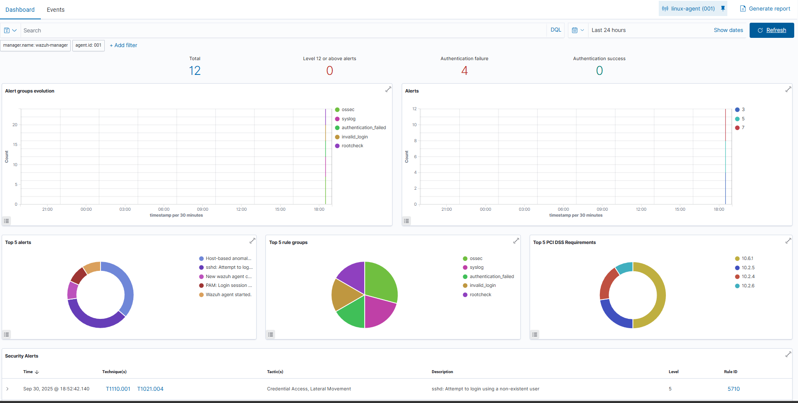
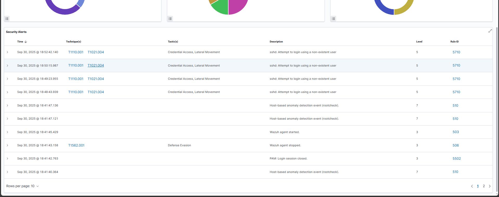
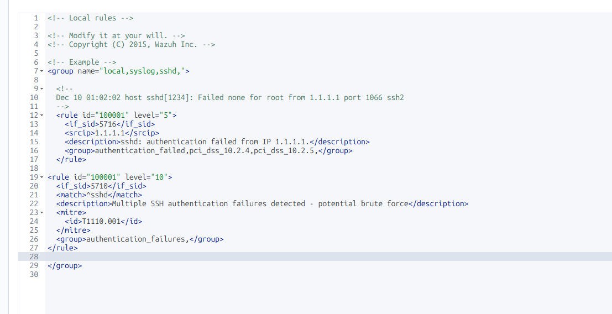

# Home SOC Lab - Azure SIEM with Wazuh

A cloud-based Security Operations Center (SOC) lab demonstrating threat detection, log analysis, and security monitoring using Wazuh SIEM deployed on Microsoft Azure.

## Project Overview

This project implements a functional security monitoring environment using Wazuh, an open-source SIEM platform. The lab simulates real-world attack scenarios and demonstrates the ability to detect, alert, and investigate security incidents using custom detection rules.

## Architecture


**Infrastructure:**
- 1x Ubuntu Server 22.04 VM - Wazuh Manager (SIEM + Dashboard)
- 1x Ubuntu Server 22.04 VM - Linux Agent (monitored endpoint)
- 1x Windows Server 2022 VM - Windows Agent (monitored endpoint)
- Azure Virtual Network with private IP addressing
- Network Security Groups for traffic control

**Components:**
- **Wazuh Manager**: Central log aggregation and analysis engine
- **Wazuh Indexer**: Data storage and search
- **Wazuh Dashboard**: Web-based visualization and management interface
- **Wazuh Agents**: Lightweight collectors deployed on endpoints

## Technologies Used

- **Cloud Platform**: Microsoft Azure
- **SIEM**: Wazuh 4.7
- **Operating Systems**: Ubuntu 22.04 LTS, Windows Server 2022
- **Monitoring**: Sysmon (Windows), auditd (Linux)
- **Protocols**: SSH, HTTPS, TCP/IP

## Setup Summary

1. Deployed Azure infrastructure with VMs in isolated VNet

**Azure Setup**


2. Installed Wazuh Manager with all-in-one installation script

**Wazuh**


3. Configured Wazuh agents on Linux and Windows endpoints



4. Established secure communication between agents and manager
5. Enabled File Integrity Monitoring and log collection

## Detection Rules

### SSH Brute Force Detection

Created a custom detection rule to identify SSH brute force attacks by correlating multiple failed authentication attempts:

```xml
<rule id="100001" level="10" frequency="5" timeframe="120">
  <if_matched_sid>5710</if_matched_sid>
  <description>SSH brute force attempt detected - 5+ failures in 2 minutes</description>
  <mitre>
    <id>T1110.001</id>
  </mitre>
</rule>
```

**Detection Logic:**
- Triggers on 5+ failed SSH login attempts within 120 seconds
- Maps to MITRE ATT&CK technique T1110.001 (Brute Force: Password Guessing)
- Elevated severity level (10) for immediate SOC attention

## Attack Simulations

### SSH Brute Force Attack
Simulated credential stuffing attack by generating multiple failed authentication attempts against the Linux agent. The attack was detected and alerted on within seconds, demonstrating the effectiveness of the custom detection rule.

**Technique**: MITRE ATT&CK T1110.001 - Brute Force: Password Guessing  
**Result**: Successfully detected and alerted with proper MITRE mapping

## Key Findings




- Wazuh's built-in rules provide solid baseline detection coverage



- Custom rules allow tuning for specific threat scenarios and reducing false positives




- Agent-based architecture enables centralized visibility across multiple platforms
- Real-time alerting provides immediate notification of suspicious activity

## Lessons Learned

- Network configuration in cloud environments requires careful VNet design to allow inter-VM communication
- Windows logging requires additional tooling (Sysmon) for meaningful security visibility
- Azure's free tier limitations (public IP quotas) require architectural adjustments
- Detection rule tuning is essential - frequency thresholds prevent alert fatigue

## Skills Demonstrated

- Cloud infrastructure deployment and management (Azure)
- SIEM configuration and administration (Wazuh)
- Security log analysis and threat detection
- Custom detection rule development
- MITRE ATT&CK framework mapping
- Network security and segmentation
- Linux and Windows system administration
